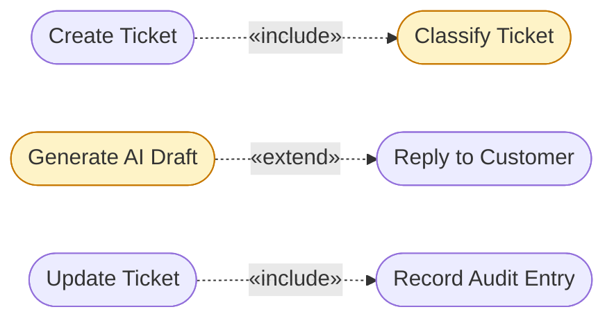

# Use Case Diagram

**ServiceDesk AI** — three actors, 22 use cases. Every use case below corresponds to a real screen and a real API endpoint; nothing here is drawn that is not implemented.

---

## Full use case diagram

```mermaid
flowchart LR
    customer(("Customer"))
    agent(("Support<br/>Agent"))
    admin(("Admin"))

    subgraph system["ServiceDesk AI — System Boundary"]
        direction TB

        subgraph shared["Shared"]
            login(["Register / Login"])
            profile(["Manage Profile"])
            notify(["Receive Notifications"])
        end

        subgraph cust["Customer use cases"]
            create(["Create Ticket"])
            viewOwn(["View Ticket"])
            reply(["Reply to Ticket"])
            track(["Track Ticket Status"])
        end

        subgraph ag["Agent use cases"]
            queue(["View Ticket Queue"])
            search(["Search Tickets"])
            update(["Update Ticket"])
            assign(["Assign / Escalate Ticket"])
            respond(["Reply to Customer"])
            useAi(["Use AI Assistance"])
            agentDash(["View Dashboard"])
        end

        subgraph adm["Admin use cases"]
            manageUsers(["Manage Users"])
            manageAgents(["Manage Agents"])
            manageTickets(["Manage Tickets"])
            manageCats(["Manage Categories"])
            reports(["View Reports"])
            adminDash(["View Dashboard"])
            monitor(["Monitor Activity Log"])
        end
    end

    customer --- login
    customer --- profile
    customer --- create
    customer --- viewOwn
    customer --- reply
    customer --- track
    customer --- notify

    agent --- login
    agent --- profile
    agent --- queue
    agent --- search
    agent --- update
    agent --- assign
    agent --- respond
    agent --- useAi
    agent --- agentDash
    agent --- notify

    admin --- login
    admin --- manageUsers
    admin --- manageAgents
    admin --- manageTickets
    admin --- manageCats
    admin --- reports
    admin --- adminDash
    admin --- monitor
    admin --- notify

    style system fill:#F7FBFB,stroke:#028090,stroke-width:2px,stroke-dasharray: 6 4
    style shared fill:#EEF6F7,stroke:#94A3B8
    style cust fill:#EAF6F5,stroke:#028090
    style ag fill:#E0F2F1,stroke:#00A896
    style adm fill:#E2E8F0,stroke:#0A2E36
```

---

## Relationships

Two relationships that a plain actor-to-use-case diagram cannot show:

- **«include»** — *Create Ticket* always includes *Classify Ticket*; *Update Ticket* always includes *Record Audit Entry*. These happen every time, without the actor asking.
- **«extend»** — *Generate AI Draft* extends *Reply to Customer*. It is optional: the agent may write the reply entirely themselves, and the reply use case is complete without it.

---

## Use case to implementation map

| Use case | Actor | Screen | API endpoint |
|---|---|---|---|
| Register / Login | All | `/register`, `/login` | `POST /auth/register`, `POST /auth/login` |
| Manage Profile | All | `/profile` | `PATCH /users/me`, `PATCH /users/me/password` |
| Receive Notifications | All | `/notifications` | `GET /notifications` |
| Create Ticket | Customer | `/tickets/new` | `POST /tickets` |
| View Ticket | Customer | `/tickets/:id` | `GET /tickets/:id` |
| Reply to Ticket | Customer | `/tickets/:id` | `POST /tickets/:id/messages` |
| Track Ticket Status | Customer | `/tickets`, `/dashboard` | `GET /tickets`, `GET /dashboard/customer` |
| View Ticket Queue | Agent | `/agent/queue` | `GET /tickets` |
| Search Tickets | Agent | `/agent/queue` | `GET /tickets?q=&status=…` |
| Update Ticket | Agent | `/tickets/:id` | `PATCH /tickets/:id`, `PATCH /tickets/:id/status` |
| Assign / Escalate | Agent | `/tickets/:id` | `PATCH /tickets/:id/assign` |
| Reply to Customer | Agent | `/tickets/:id` | `POST /tickets/:id/messages` |
| Use AI Assistance | Agent | `/tickets/:id` | `POST /ai/tickets/:id/draft-reply`, `/summary`, `/resolution-steps` |
| View Dashboard | Agent | `/agent` | `GET /dashboard/agent` |
| Manage Users | Admin | `/admin/users` | `GET/POST /users`, `PATCH /users/:id/role` |
| Manage Agents | Admin | `/admin/users` | `PATCH /users/:id/role`, `PATCH /users/:id/status` |
| Manage Tickets | Admin | `/admin/tickets` | `GET /tickets`, `DELETE /tickets/:id` |
| Manage Categories | Admin | `/admin/categories` | `GET/POST/PATCH/DELETE /categories` |
| View Reports | Admin | `/admin/reports` | `GET /reports/*` |
| View Dashboard | Admin | `/admin` | `GET /dashboard/admin` |
| Monitor Activity Log | Admin | `/admin/activity` | `GET /audit-logs` |
