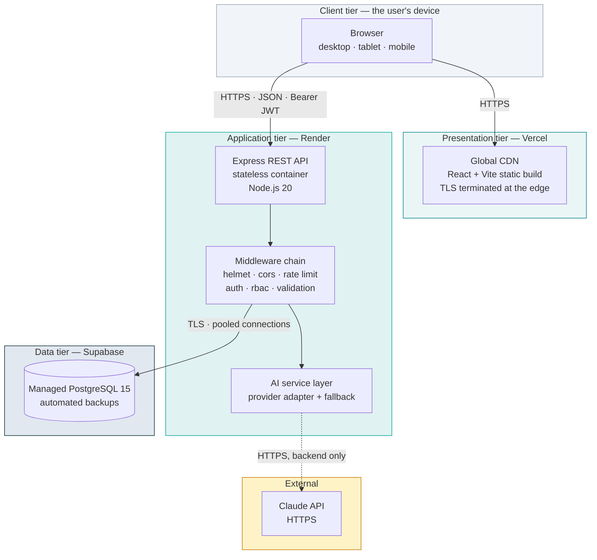
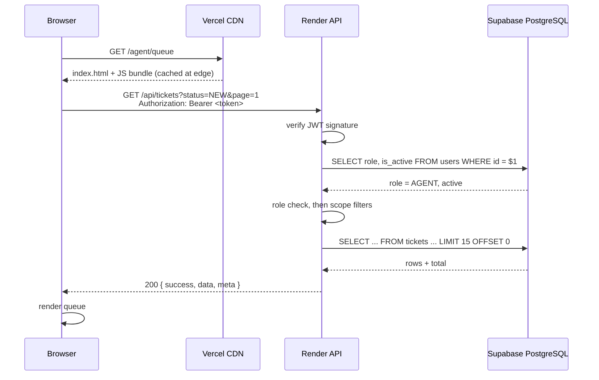
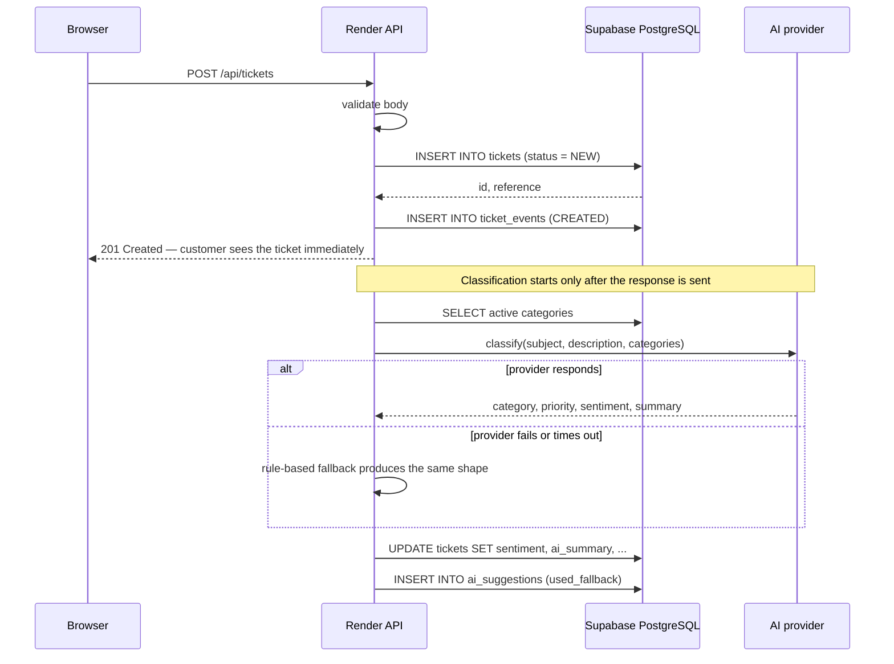
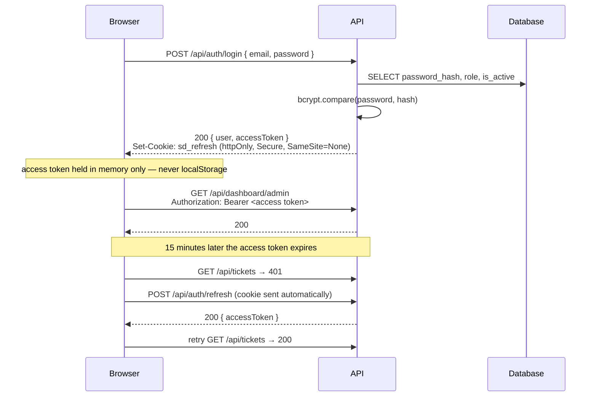
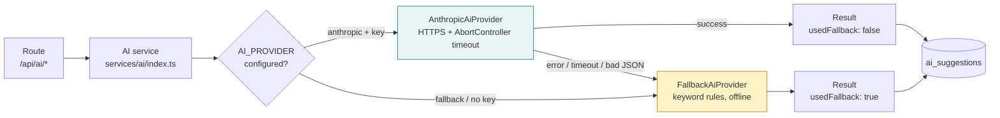
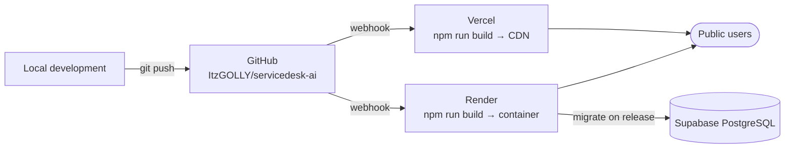

# Cloud Architecture

---

## 1. Overview

ServiceDesk AI is a three-tier cloud-native application. Each tier is deployed independently on a managed platform, and no component runs on hardware the team owns or administers.

**The browser talks to two hosts:** Vercel for static assets, and Render for the API. It never talks to the database, and it never talks to the AI provider.

---

## 2. Components

| Component | Platform | Service model | Responsibility |
|---|---|---|---|
| React SPA | Vercel | PaaS / static CDN | Rendering, routing, client-side state |
| Express REST API | Render | PaaS (container) | Authentication, authorisation, business rules, data access |
| PostgreSQL | Supabase | DBaaS | Durable storage, constraints, indexes, backups |
| AI provider | Anthropic API | SaaS | Optional classification and drafting |

### Why these platforms

All four are on the course guidelines' permitted list, all have free tiers sufficient for a student project, and each is the simplest reliable choice for its tier:

- **Vercel** builds from a Git push and serves the result from a global CDN. Static assets need no server.
- **Render** runs a long-lived Node process with a health check and zero-downtime deploys — a better fit for a stateful-feeling REST API than serverless functions, and it keeps the three-tier architecture literal rather than notional.
- **Supabase** provides managed PostgreSQL with backups and connection pooling, so no team member administers a database server.

We deliberately did not use Kubernetes, microservices, a message queue or a separate cache. None is justified at this scale, and each would add failure modes we would then have to explain.

---

## 3. Data flow

### 3.1 Reading a ticket list

The user row is re-read on every request rather than trusting the token's claims, so a role change or deactivation takes effect immediately.

### 3.2 Creating a ticket, with AI off the critical path

This ordering is the core reliability decision: the customer's request is already answered before the AI is contacted, so an outage or a slow provider cannot delay or fail ticket creation.

---

## 4. Authentication flow

**Two tokens, two storage strategies, for two different threats.**

- The **access token** is short-lived (15 min) and kept in a JavaScript variable. It is never written to `localStorage`, so an injected script cannot read a long-lived credential.
- The **refresh token** is long-lived (7 days) and stored in an `httpOnly` cookie, which JavaScript cannot read at all. It is scoped to `/api/auth`, so it is only ever transmitted to the endpoints that need it.

The refresh-and-retry is handled once inside `frontend/src/lib/api.ts`, so no page has to think about token expiry.

---

## 5. Authorisation

Two independent layers, both server-side:

1. **Route level** — `requireRole('ADMIN')` middleware answers "may this role call this endpoint at all?"
2. **Record level** — inside the handler, `getTicketForUser()` answers "does this record belong to this user?"

Both are necessary. Route middleware cannot know whether ticket `X` belongs to customer `Y`; it can only see the role. A customer requesting another customer's ticket passes layer 1 and is stopped by layer 2 — with a `404`, not a `403`, so ticket identifiers cannot be probed for existence.

The React route guards are convenience only. Bypassing them in the browser gains nothing, which the authorisation test suite demonstrates by calling the API directly with a valid token for the wrong role.

---

## 6. AI integration flow

Both providers implement the same `AiProvider` interface, so calling code never branches on which is active. Every failure path — network error, timeout, rate limit, malformed response — converges on the fallback, and the outcome carries a `usedFallback` flag that reaches both the database and the user interface.

**The API key exists only as a Render environment variable.** It is read by `env.ts` on the server and used only inside `AnthropicAiProvider`. It is not in the repository, not in the frontend bundle, and not in any API response.

---

## 7. Deployment flow

Both platforms build from the same repository on push to `main`. Render runs migrations as part of its release step, so the schema is always current before new code serves traffic. Full instructions are in [`DEPLOYMENT.md`](DEPLOYMENT.md).

---

## 8. How the non-functional requirements are met

### Scalability

The API stores no session state — sessions are JWTs, and everything else is in PostgreSQL. That single property is what allows the platform to run N replicas behind a load balancer with no sticky sessions and no shared memory. The connection pool is bounded per instance so replicas do not exhaust the database's connection limit. The frontend scales independently and essentially for free, because static assets are cached at CDN edges.

### Availability

Each tier is a managed service with platform-level redundancy. `/api/health` verifies the process *and* the database, so a half-broken instance is reported as unhealthy rather than silently serving errors. `SIGTERM` triggers a graceful shutdown, so a redeploy finishes in-flight requests. The AI dependency degrades instead of failing.

### Performance

Every filterable column is indexed and search uses a GIN index rather than a table scan. Pagination bounds response size. The client caches query results briefly. The AI call is asynchronous relative to the request that triggers it.

### Security

TLS on every hop, enforced by the platforms. Secrets only in environment variables. CORS restricted to an explicit origin allow-list — necessary because credentialed requests require an exact origin match. Helmet sets security headers; the auth endpoints are rate limited.

---

## 9. Known constraints of the free tier

Stated plainly because they affect a live demonstration:

| Constraint | Effect | Mitigation |
|---|---|---|
| Render free instances sleep after ~15 minutes idle | First request takes ~50 s | Scheduled ping every 10 minutes; open the app 5 minutes before demonstrating; the UI shows a loading state rather than appearing broken |
| Supabase free projects pause after ~7 days idle | API returns 503 | The same ping keeps the database active; check the project 24 hours before each review |
| Vercel free tier has no meaningful limit at this scale | None | — |

---

## 10. Cloud computing concepts demonstrated

| Concept | Where it appears |
|---|---|
| **SaaS** | The delivered product: multi-user support software accessed over the internet with no client installation |
| **PaaS** | Vercel and Render — we deploy code, the platform manages runtime, scaling and TLS |
| **DBaaS** | Supabase — managed PostgreSQL with backups and pooling |
| **Horizontal scalability** | Stateless API replicas, enabled by JWT sessions and externalised state |
| **Elasticity** | Platforms allocate instances on demand rather than to a fixed capacity |
| **Multi-tenancy (by role)** | One deployment and one database serve customers, agents and admins, isolated by row-level scoping in the API |
| **CDN / edge distribution** | Static frontend cached near the user |
| **Managed services** | No team member patches an operating system or configures a database server |
| **Graceful degradation** | The AI dependency fails soft rather than taking a feature down |
| **Infrastructure as configuration** | Environment variables and build commands, not manually configured servers |
