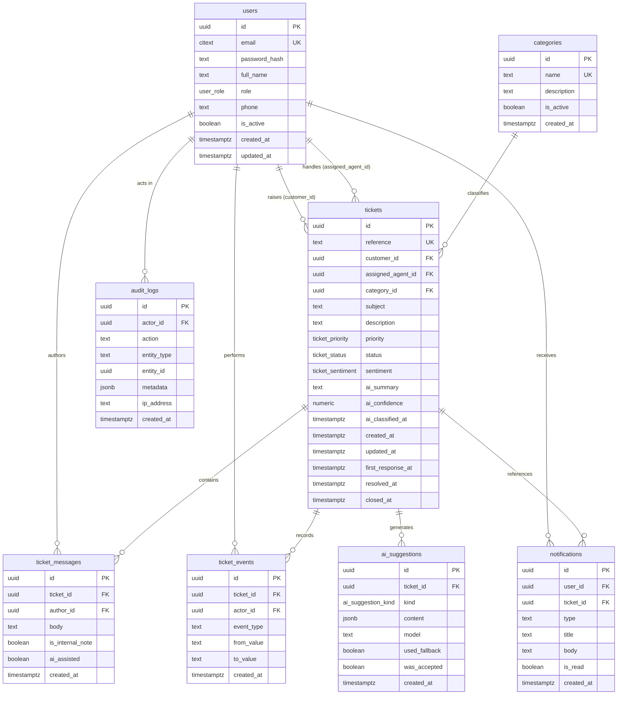

# Database Design

PostgreSQL 15+, hosted as a managed cloud service (Supabase). The schema is defined by `backend/src/db/migrations/001_init.sql`, which is the single source of truth — **this document and the ER diagram are derived from that file, so they cannot describe a database that does not exist.**

---

## 1. Why a relational database

The domain is inherently relational: a ticket belongs to exactly one customer, may be assigned to one agent, may belong to one category, and owns many messages and events. These are foreign-key relationships, and expressing them in the database means the database itself refuses to create an orphaned ticket or a message with no parent.

PostgreSQL specifically gives us: enumerated types for the fixed vocabularies (role, status, priority, sentiment), `CHECK` constraints for business invariants, full-text search without an extra service, and `JSONB` for the audit metadata that genuinely varies in shape.

---

## 2. Entity Relationship Diagram



---

## 3. Enumerated types

Fixed vocabularies are modelled as PostgreSQL enums rather than lookup tables. The set of values is defined by the specification and never edited at runtime, so an enum gives the same integrity guarantee with one fewer join and makes an invalid value impossible to insert.

| Type | Values |
|---|---|
| `user_role` | `CUSTOMER`, `AGENT`, `ADMIN` |
| `ticket_status` | `NEW`, `OPEN`, `IN_PROGRESS`, `WAITING_FOR_CUSTOMER`, `RESOLVED`, `CLOSED` |
| `ticket_priority` | `LOW`, `MEDIUM`, `HIGH`, `URGENT` |
| `ticket_sentiment` | `POSITIVE`, `NEUTRAL`, `NEGATIVE` |
| `ai_suggestion_kind` | `CLASSIFICATION`, `DRAFT_REPLY`, `SUMMARY`, `RESOLUTION_STEPS` |

Enum declaration order matters: `ticket_priority` sorts `LOW < MEDIUM < HIGH < URGENT`, so `ORDER BY priority DESC` puts urgent tickets at the top of the agent queue without any additional column.

---

## 4. Entities

### 4.1 `users`

Every person who can sign in, of any role.

| Column | Type | Notes |
|---|---|---|
| `id` | `UUID` | Primary key, `gen_random_uuid()` |
| `email` | `CITEXT` | Unique. Case-insensitive so `Rohan@x.com` and `rohan@x.com` are the same account |
| `password_hash` | `TEXT` | bcrypt hash, cost 12. Never the password itself |
| `full_name` | `TEXT` | Not blank |
| `role` | `user_role` | Defaults to `CUSTOMER` |
| `phone` | `TEXT` | Optional |
| `is_active` | `BOOLEAN` | `FALSE` blocks sign-in while preserving history |
| `created_at`, `updated_at` | `TIMESTAMPTZ` | `updated_at` maintained by trigger |

**Constraints:** `users_full_name_not_blank`, `users_email_shape` (structural email check).
**Indexes:** unique on `email`; `idx_users_role`; `idx_users_is_active`.

> **Why one table for all three roles?** A person is a person; the role is an attribute, not a different kind of entity. Separate tables would duplicate every authentication column three times and make "change this user's role" a delete-and-recreate instead of a single `UPDATE`.

### 4.2 `categories`

Admin-managed grouping for tickets, and the closed vocabulary the AI classifier is allowed to propose from.

| Column | Type | Notes |
|---|---|---|
| `id` | `UUID` | Primary key |
| `name` | `TEXT` | Unique, not blank |
| `description` | `TEXT` | Optional |
| `is_active` | `BOOLEAN` | Inactive categories are hidden from new tickets but retained on old ones |
| `created_at` | `TIMESTAMPTZ` | |

### 4.3 `tickets`

The core business entity.

| Column | Type | Notes |
|---|---|---|
| `id` | `UUID` | Primary key, used in the API |
| `reference` | `TEXT` | Unique, `'SD-' || nextval(...)` — the short identifier a customer quotes |
| `customer_id` | `UUID` | → `users.id`, `ON DELETE RESTRICT` |
| `assigned_agent_id` | `UUID` | → `users.id`, nullable, `ON DELETE SET NULL` |
| `category_id` | `UUID` | → `categories.id`, nullable, `ON DELETE SET NULL` |
| `subject`, `description` | `TEXT` | Not blank |
| `priority` | `ticket_priority` | Default `MEDIUM` |
| `status` | `ticket_status` | Default `NEW` |
| `sentiment` | `ticket_sentiment` | Nullable — unset until classified |
| `ai_summary` | `TEXT` | Nullable |
| `ai_confidence` | `NUMERIC(3,2)` | Nullable, constrained to 0–1 |
| `ai_classified_at` | `TIMESTAMPTZ` | Nullable; `NULL` means never classified |
| `created_at`, `updated_at` | `TIMESTAMPTZ` | |
| `first_response_at` | `TIMESTAMPTZ` | Set on the first public staff reply |
| `resolved_at`, `closed_at` | `TIMESTAMPTZ` | Drive the resolution-time reports |

**Two UUID foreign keys to the same table.** `customer_id` and `assigned_agent_id` both reference `users`, which is why every ticket query joins `users` twice under different aliases.

**Every AI column is nullable.** This is deliberate: a ticket must be creatable when the AI service is unavailable.

**Constraints**

| Constraint | Purpose |
|---|---|
| `tickets_subject_not_blank`, `tickets_description_not_blank` | Reject whitespace-only content |
| `tickets_ai_confidence_range` | Confidence stays within 0–1 |
| `tickets_resolved_at_consistent` | `resolved_at` may only be set when status is `RESOLVED` or `CLOSED` |
| `tickets_closed_at_consistent` | `closed_at` may only be set when status is `CLOSED` |

The last two are the reason reopening a ticket clears its timestamps — the database would reject the row otherwise. The invariant is enforced even if application code is wrong.

**Delete behaviour.** `customer_id` uses `RESTRICT`: a user with tickets cannot be deleted, because that would destroy the support history. Admins deactivate users instead. `assigned_agent_id` uses `SET NULL`: if an agent is removed, their tickets return to the unassigned queue rather than disappearing.

**Indexes**

| Index | Supports |
|---|---|
| `idx_tickets_customer` | Customer's own ticket list; scoping every customer query |
| `idx_tickets_agent` | Agent queue and workload report |
| `idx_tickets_category` | Category filter and category report |
| `idx_tickets_status` | Status filter, dashboard counts |
| `idx_tickets_priority` | Priority filter and queue ordering |
| `idx_tickets_sentiment` | Sentiment filter and distribution report |
| `idx_tickets_created_at` (DESC) | Default ordering and trend queries |
| `idx_tickets_search` (GIN) | Full-text search over subject + description |

### 4.4 `ticket_messages`

The conversation thread.

| Column | Type | Notes |
|---|---|---|
| `id` | `UUID` | Primary key |
| `ticket_id` | `UUID` | → `tickets.id`, `ON DELETE CASCADE` |
| `author_id` | `UUID` | → `users.id`, `ON DELETE RESTRICT` |
| `body` | `TEXT` | Not blank |
| `is_internal_note` | `BOOLEAN` | `TRUE` = visible to staff only |
| `ai_assisted` | `BOOLEAN` | `TRUE` when the author started from an AI draft |
| `created_at` | `TIMESTAMPTZ` | |

`is_internal_note` is filtered in SQL, not in the client, so a customer's request never returns note content in the first place.

`ai_assisted` is what makes the admin dashboard's AI statistic honest: it counts replies a human actually sent after starting from a draft.

**Index:** `idx_ticket_messages_ticket (ticket_id, created_at)` — a composite index, because the thread is always read for one ticket in chronological order.

### 4.5 `ticket_events`

An append-only timeline of what happened to a ticket: creation, assignment, status and priority changes.

| Column | Type | Notes |
|---|---|---|
| `id` | `UUID` | Primary key |
| `ticket_id` | `UUID` | → `tickets.id`, `ON DELETE CASCADE` |
| `actor_id` | `UUID` | → `users.id`, `ON DELETE SET NULL` — the event survives the user |
| `event_type` | `TEXT` | e.g. `STATUS_CHANGED` |
| `from_value`, `to_value` | `TEXT` | Stored as text so one table records any kind of change |

### 4.6 `ai_suggestions`

Every AI output, retained for review and for honest statistics.

| Column | Type | Notes |
|---|---|---|
| `kind` | `ai_suggestion_kind` | Which capability produced it |
| `content` | `JSONB` | Shape differs per kind — `JSONB` is the right fit |
| `model` | `TEXT` | Which model or engine produced it |
| `used_fallback` | `BOOLEAN` | `TRUE` when the rule-based engine produced it |
| `was_accepted` | `BOOLEAN` | Whether the agent used it |

Keeping `used_fallback` means the dashboard can report AI usage without overstating it during a provider outage.

### 4.7 `notifications`

| Column | Type | Notes |
|---|---|---|
| `user_id` | `UUID` | → `users.id`, `ON DELETE CASCADE` |
| `ticket_id` | `UUID` | → `tickets.id`, nullable, `ON DELETE CASCADE` |
| `type`, `title`, `body` | `TEXT` | |
| `is_read` | `BOOLEAN` | |

**Index:** `idx_notifications_user (user_id, is_read, created_at DESC)` — a covering composite for the unread-count badge, which is the most frequent query in the application.

### 4.8 `audit_logs`

| Column | Type | Notes |
|---|---|---|
| `actor_id` | `UUID` | → `users.id`, `ON DELETE SET NULL` — the log outlives the account |
| `action` | `TEXT` | e.g. `USER_ROLE_CHANGED` |
| `entity_type`, `entity_id` | `TEXT`, `UUID` | What was acted on |
| `metadata` | `JSONB` | Action-specific detail |
| `ip_address` | `TEXT` | |

---

## 5. Relationship summary

| Relationship | Cardinality | Delete rule |
|---|---|---|
| `users` → `tickets` (customer) | 1 : N | RESTRICT — protects support history |
| `users` → `tickets` (agent) | 1 : N, optional | SET NULL — ticket returns to the queue |
| `categories` → `tickets` | 1 : N, optional | SET NULL |
| `tickets` → `ticket_messages` | 1 : N | CASCADE |
| `tickets` → `ticket_events` | 1 : N | CASCADE |
| `tickets` → `ai_suggestions` | 1 : N | CASCADE |
| `tickets` → `notifications` | 1 : N, optional | CASCADE |
| `users` → `notifications` | 1 : N | CASCADE |
| `users` → `audit_logs` | 1 : N, optional | SET NULL |

---

## 6. Normalisation

The schema is in third normal form.

- **1NF** — every column holds a single atomic value. The two `JSONB` columns hold genuinely variable documents (AI output, audit metadata), not lists that should be rows.
- **2NF** — every table has a single-column primary key, so no partial dependency is possible.
- **3NF** — no non-key column depends on another non-key column. Category name lives only in `categories`; agent name lives only in `users`. Ticket queries join for those names rather than storing copies.

**One deliberate exception.** `tickets.first_response_at` and `resolved_at` are derivable by scanning `ticket_messages` and `ticket_events`. They are stored anyway because average resolution time appears on three dashboards, and computing it from the event log on every request would mean an aggregate scan per page load. This is a considered trade-off, not an oversight.

---

## 7. Migrations

Schema changes are numbered SQL files in `backend/src/db/migrations/`, applied in filename order by `npm run migrate`. A `schema_migrations` table records what has already run, so the command is safe to repeat and each migration runs inside a transaction — a failure leaves the schema untouched.

```bash
npm run migrate   # apply pending migrations
npm run seed      # load demo users, categories and tickets
```

---

## 8. Representative queries

**Agent queue, prioritised** — uses `idx_tickets_status` and the enum ordering:

```sql
SELECT t.reference, t.subject, t.priority, u.full_name
  FROM tickets t
  JOIN users u ON u.id = t.customer_id
 WHERE t.assigned_agent_id = $1
   AND t.status NOT IN ('RESOLVED', 'CLOSED')
 ORDER BY t.priority DESC, t.created_at ASC;
```

**Full-text search** — uses `idx_tickets_search`:

```sql
SELECT reference, subject
  FROM tickets
 WHERE to_tsvector('english', subject || ' ' || description)
       @@ plainto_tsquery('english', $1);
```

**30-day trend with no gaps** — `generate_series` supplies every date, so days with no tickets appear as zero rather than vanishing from the chart:

```sql
SELECT TO_CHAR(d.day, 'YYYY-MM-DD') AS day, COUNT(t.id) AS count
  FROM generate_series(CURRENT_DATE - INTERVAL '29 days', CURRENT_DATE, '1 day') AS d(day)
  LEFT JOIN tickets t ON DATE(t.created_at) = d.day
 GROUP BY d.day ORDER BY d.day;
```
