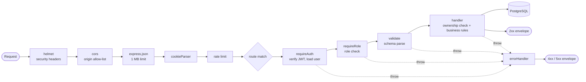

# System Architecture and Module Design

Infrastructure and hosting are covered in [`CLOUD_ARCHITECTURE.md`](CLOUD_ARCHITECTURE.md). This document describes how the code itself is organised.

---

## 1. Backend module structure

Backend folders are named after the **Suggested Modules** in the official Project 19 specification, so the mapping from requirement to code is visible in the repository tree.

```
backend/src/
├── config/env.ts                 Validated environment configuration
├── db/
│   ├── pool.ts                   Connection pool, query helpers, transactions
│   ├── migrate.ts                Migration runner
│   ├── seed.ts                   Demo data
│   └── migrations/001_init.sql   Schema — the source of truth
├── middleware/
│   ├── auth.ts                   JWT verification, req.user
│   ├── rbac.ts                   Role checks
│   ├── validate.ts               Zod request validation
│   └── errorHandler.ts           404 and the single error-to-HTTP boundary
├── modules/
│   ├── authentication/           ← spec module "Authentication"
│   ├── user-management/          ← spec module "User Management"
│   ├── tickets/                  ← spec module "Core Business Module"
│   │   ├── lifecycle.ts          Transition table and rules
│   │   ├── tickets.service.ts    Queries, scoping, classification
│   │   ├── tickets.schemas.ts    Validation schemas
│   │   └── tickets.routes.ts     HTTP layer
│   ├── reports/                  ← spec module "Reports & Analytics"
│   ├── administration/           ← spec module "Administration"
│   ├── notifications/
│   └── ai/                       Design decision, not a spec module
├── services/
│   ├── ai/                       Provider adapter, Anthropic client, fallback
│   ├── audit.ts                  Audit logging
│   └── notifications.ts          Notification creation
├── utils/
│   ├── ApiError.ts               One error type with status and code
│   ├── http.ts                   asyncHandler, response envelopes
│   └── security.ts               Hashing and token signing
├── app.ts                        Middleware chain and route mounting
└── server.ts                     Boot, health check, graceful shutdown
```

### Why this layering

Each module keeps its routes, validation schemas and data access together. That is deliberate: to understand ticket assignment you open `modules/tickets/` and everything is there, rather than tracing through parallel `controllers/`, `services/` and `models/` trees.

Only genuinely shared behaviour is extracted — error handling, authentication, validation, the database pool. The result is a codebase with very little indirection, which matters because both team members must be able to explain any line during evaluation.

---

## 2. Request lifecycle

Every API request passes through the same chain:



Failures at any stage throw an `ApiError` and land in one place. No handler formats its own error response, which is why the API cannot accidentally leak a stack trace from one forgotten route.

---

## 3. Key design decisions

### 3.1 The lifecycle lives in one table

`modules/tickets/lifecycle.ts` holds the transition map and the role rules. Every status change consults it.

The alternative — scattering `if (ticket.status === 'NEW')` checks through handlers — makes it impossible to answer "what transitions are legal?" without reading the whole module, and lets the API be walked into an impossible state by calling endpoints in an unusual order. Centralising it also makes the rules directly unit-testable without a database.

### 3.2 Role scoping happens in the query builder

`buildFilters()` in `tickets.service.ts` adds `t.customer_id = $currentUser` whenever the caller is a customer, before any user-supplied filter is applied.

This means there is no code path in which a customer lists another customer's tickets, even if they craft the query string by hand. Security that depends on every future handler remembering a check is security that eventually fails; security applied once in the shared query builder does not.

### 3.3 Two authorisation layers

Route middleware checks the role; the handler checks record ownership. Neither is sufficient alone — see [`CLOUD_ARCHITECTURE.md` §5](CLOUD_ARCHITECTURE.md).

### 3.4 AI behind an interface, with a real fallback

`AiProvider` has two implementations. `attempt()` in `services/ai/index.ts` runs the primary and converges every failure on the fallback.

The fallback is not a stub — it is a working keyword classifier with category playbooks. That is what makes "what happens if the AI fails?" a demonstrable answer rather than a hopeful one, and it means the whole system is developable and testable with no API key.

### 3.5 Classification is fire-and-forget

`tickets.routes.ts` calls `void classifyAndStore(id)` *after* responding. The customer never waits for the AI, and an AI failure cannot fail a ticket creation.

The trade-off is a brief window where a new ticket is unclassified. That is acceptable — the UI shows the ticket immediately and the classification appears on the next load.

### 3.6 Best-effort side effects

Audit logging and notification creation catch and log their own errors. A failure to write a notification must not roll back the status change that caused it: the user-visible operation succeeded, and reporting otherwise would be wrong.

---

## 4. Frontend structure

```
frontend/src/
├── lib/
│   ├── api.ts                    fetch wrapper, token handling, refresh-and-retry
│   ├── types.ts                  Shared TypeScript types
│   └── format.ts                 Dates, labels, badge colour mapping
├── context/AuthContext.tsx       Session state, login/register/logout
├── components/
│   ├── ui.tsx                    Card, StatTile, Modal, EmptyState, Pagination…
│   ├── TicketBits.tsx            Status/priority/sentiment badges, ticket row
│   ├── AiPanel.tsx               AI assistance panel
│   └── layout/AppShell.tsx       Sidebar, top bar, notification badge
├── pages/
│   ├── Landing · Login · Register
│   ├── customer/                 Dashboard, CreateTicket
│   ├── agent/                    Dashboard
│   ├── admin/                    Dashboard, Users, Categories, Reports, Activity
│   ├── TicketList.tsx            Shared list, customer and staff variants
│   ├── TicketDetail.tsx          Shared detail, role-aware
│   ├── Notifications.tsx
│   └── Profile.tsx
├── App.tsx                       Routes and guards
└── main.tsx                      Providers and entry point
```

### 4.1 One list and one detail page for all roles

`TicketList` takes a `variant` prop and `TicketDetail` reads the current role. Three copies of each would drift apart, and the differences are genuinely small: staff get more filters, internal notes and the AI panel.

The server enforces the actual boundaries independently, so these components decide only what to draw.

### 4.2 Server state versus UI state

TanStack Query owns everything that comes from the API — caching, loading and error states, refetch after mutation. React `useState` owns only local UI state such as form fields and filter selections.

Keeping that line clear is why no page contains manual `useEffect` fetching or hand-rolled loading flags.

### 4.3 Token handling in one place

`lib/api.ts` holds the access token in a module variable, attaches it to every request, and on a `401` refreshes once and replays the original request. No page or component deals with expiry.

---

## 5. Error handling

| Failure | Behaviour |
|---|---|
| Validation failure | `400` with per-field messages; the form shows them beside each field |
| Missing or expired token | `401`; the client refreshes once and retries transparently |
| Wrong role | `403` with a readable message |
| Another customer's ticket | `404` — existence is not disclosed |
| Invalid lifecycle transition | `422` naming the permitted transitions |
| Duplicate email or category | `409` |
| Malformed UUID | `400` |
| Database unavailable | `503` from `/api/health`; other routes return a generic `500` |
| AI provider unavailable | Fallback result, flagged in the response and shown in the panel |
| Network failure in the browser | "Cannot reach the server" with a retry control |

Users never see a stack trace or a raw PostgreSQL message. In development only, the underlying message is attached as `error.debug`.
